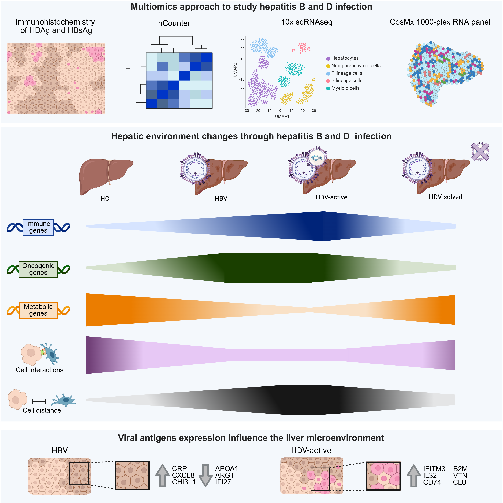

# HDV infection shapes a distinct liver microenvironment that is partially restored after viral clearance

[](https://cran.r-project.org/)
[](https://www.python.org/)
[](https://zenodo.org/records/21071995)
[](https://opensource.org/licenses/MIT)

This repository contains the analytical pipelines and custom scripts for the single-cell and spatial transcriptomics profiling of HBV and HDV infection in human liver samples. Data integration relies heavily on **NanoString CosMx SMI** and **scRNA-seq** spatial mapping.

## Highlights

* **Microenvironment Remodeling:** HDV induces distinct hepatic microenvironment remodeling at both transcriptomic and spatial levels compared to HBV monoinfection.
* **Viral Antigen Niches:** HBsAg and HDAg establish distinct, highly localized hepatic microenvironments.
* **Cellular Communication:** Active viral infection systematically disrupts hepatocyte cellular communication, particularly with Kupffer cells.
* **Viral Clearance:** HDV clearance restores hepatocyte programming, tissue architecture, and cellular interaction networks.

## Graphical Abstract



## Interactive Data Explorer

To facilitate data exploration and open science, we have deployed a public interactive Shiny web application accompanying this manuscript:
**[CosMx Liver Data Explorer](https://servidor2-ciberehd.upc.es/external/CosMx_liver/)**

---

## Methods Overview

* **QC & Cell Typing:** Cells underwent stringent count, probe, and area-based filtering. Supervised annotation into 28 refined cell types was performed using **InSituType** (mapped against our scRNA-seq reference).
* **Neighborhood Analysis:** Local cellular niches were defined using proximity-weighted kNN graphs (k=40) and Leiden clustering (resolution = 0.2). Niche biological interpretation was manually curated with LLM assistance.
* **DEGs & Pathways:** Differential expression was calculated via Seurat's `FindMarkers`, with pathway enrichment mapped to MSigDB via **clusterProfiler**.
* **Spatial Interactions:** Ligand-receptor mappings were modeled using **SCOTIA**. Spatial co-localization was quantified via **Squidpy** using a custom Spatial Interaction Enrichment Score (SIES) compared against 1,000 random permutations.
* **Pseudotime Trajectories:** Transitions between spatial niches were modeled using **Slingshot**, and dynamically expressed genes along these paths were fitted with General Additive Models (GAMs) using **tradeSeq**.

## Core Dependencies

Ensure your environment matches the following core package versions before executing the analytical pipeline:

* **Seurat** (v5.4)
* **InSituType** (v2.0)
* **Scanpy** (v1.10)
* **scikit-learn** (v1.3)
* **Squidpy** (v1.2.3)
* **clusterProfiler** (v4.10.1)

---

## Repository Structure

The repository is organized functionally into data processing arrays (`analysis/`) and visualization generation (`figures/`).

```text
.
├── analysis/
│   ├── cosmx/                          # Spatial transcriptomics analytical pipeline
│   │   ├── 1.qc.R
│   │   ├── 2.celltype.R
│   │   ├── 3.cellinteraction.R
│   │   ├── 4.neighborhoods.py
│   │   ├── 5.pseudotime.R
│   │   ├── 6.colocalization.py
│   │   ├── 7.localcomposition.py
│   │   └── scotia_run.py
│   └── single-cell/                    # scRNA-seq processing and integration
│       ├── 01.Cells_together.R
│       ├── 02.Subsets.R
│       ├── 03.Myeloids.R
│       ├── 04.Tcells.R
│       ├── 05.Plasma_and_bcells.R
│       ├── 06.Hepatocytes.R
│       ├── 07.Parenchymal.R
│       ├── 08.Annotation.R
│       ├── 09.All_annotated_together.R
│       ├── 10.cell_communication_analysis.py
│       └── 11.tensor_cell2cell.ipynb
├── figures/                            # Figure generation scripts
│   ├── curate_annotation_cosmx.R
│   ├── fig2.R
│   ├── fig3.R
│   ├── fig4.R
│   ├── fig5.R
│   ├── fig6.R
│   ├── fig7.R
│   ├── supfig2.R
│   ├── supfig3.R
│   ├── supfig5.R
│   ├── supfig6.R
│   └── outs/                           # Output directory for generated plots
├── Graphical_Abstract.png
└── README.md
```

## Usage

1. Download data objects from the [Zenodo repository](https://zenodo.org/records/21071995).
2. Execute the processing scripts within `analysis/single-cell/` and `analysis/cosmx/` sequentially to reproduce the data structures.
3. Run the scripts within the `figures/` directory to generate the final manuscript panels. Outputs will be routed directly to the `figures/outs/` directory.

## Citation

If you use this code, data, or interactive application in your research, please cite our publication:

> To be published...

## License

This project is licensed under the MIT License - see the LICENSE file for details.
